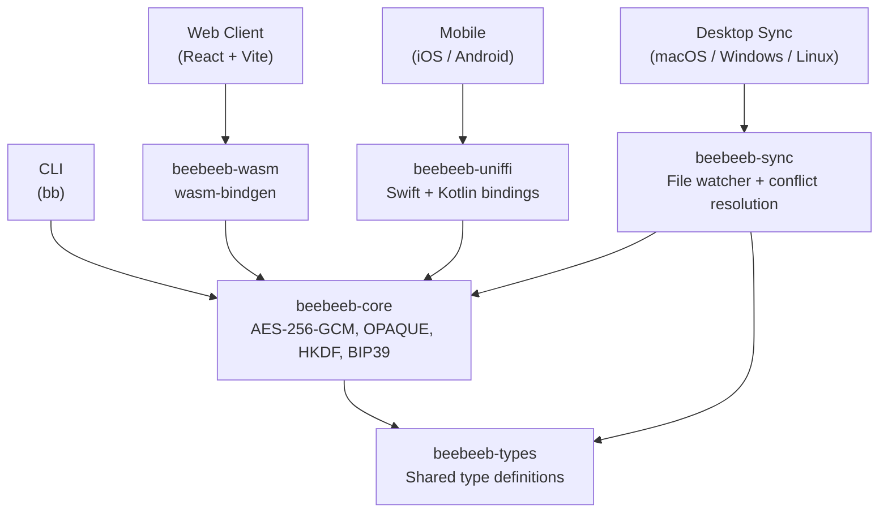

<p align="center">
  
</p>
<h3 align="center">Beebeeb Core</h3>
<p align="center">Cryptographic core, shared types, and sync engine for zero-knowledge end-to-end encryption.</p>

<p align="center">
  <a href="https://github.com/beebeeb-io/core/blob/main/LICENSE"></a>
  <a href="https://github.com/beebeeb-io/core/actions"></a>
  <a href="https://github.com/beebeeb-io/core/stargazers"></a>
</p>

---

This is the **trust anchor** of the [Beebeeb](https://beebeeb.io) ecosystem. Every client -- web, desktop, CLI, and mobile -- depends on these crates for encryption, key derivation, type definitions, and file sync. Written in Rust. Compiles to native binaries, WebAssembly, and mobile FFI bindings from a single source.

Built and operated by [Initlabs B.V.](https://initlabs.nl), Wijchen, Netherlands.

## Crates

| Crate | Description |
|---|---|
| [`beebeeb-core`](./beebeeb-core) | AES-256-GCM encryption, OPAQUE authentication, Argon2id key derivation, BIP39 recovery phrases, HKDF per-file keys, X25519 key exchange |
| [`beebeeb-types`](./beebeeb-types) | Shared types (`CipherSuite`, `EncryptedBlob`, `KdfParams`, `ChunkMeta`) used across all repos |
| [`beebeeb-sync`](./beebeeb-sync) | Desktop sync engine: file watcher, conflict resolution, selective sync |
| [`beebeeb-wasm`](./beebeeb-wasm) | WebAssembly bindings via `wasm-bindgen` for the browser client |
| [`beebeeb-uniffi`](./beebeeb-uniffi) | UniFFI bindings for Swift (iOS) and Kotlin (Android) |

## Architecture

One Rust codebase, compiled everywhere. Every platform uses the exact same encryption logic -- there is no room for platform-specific reimplementation bugs.



## Cryptographic primitives

| Primitive | Usage | Implementation |
|---|---|---|
| AES-256-GCM | File and chunk encryption | `aes-gcm` crate |
| Argon2id | Password-based key derivation (256 MiB, 4 iterations, 2 parallelism) | `argon2` crate |
| HKDF-SHA256 | Per-file key derivation from master key | `hkdf` + `sha2` crates |
| BIP39 | 24-word recovery phrases | `bip39` crate |
| X25519 | Key exchange for sharing | `x25519-dalek` crate |
| OPAQUE | Password-authenticated key exchange (server never sees password) | `opaque-ke` v4 |

## Key types

- **`MasterKey`** -- 32 bytes. Not `Clone`. Zeroized on drop. Created from a password (Argon2id) or a recovery phrase (BIP39).
- **`FileKey`** -- 32 bytes. Derived per file via `HKDF(master_key, file_id)`. Limits blast radius if a single key is compromised.
- **`EncryptedBlob`** -- cipher suite identifier + nonce + ciphertext. Self-describing and forward-compatible.

## Security invariants

These are enforced at the type-system level, not by convention:

- `MasterKey` and `FileKey` do not implement `Clone` -- prevents accidental key copies in memory
- All intermediate key buffers use `Zeroizing<[u8; 32]>` -- zeroed on drop
- Each file gets its own key via HKDF -- compromising one file key does not affect others
- The recovery phrase is the master secret; a password wraps it but does not replace it
- No panics in cryptographic code paths -- everything returns `Result`

## Getting started

### Prerequisites

- [Rust](https://rustup.rs/) (stable, edition 2024)
- [wasm-pack](https://rustwasm.github.io/wasm-pack/installer/) (only for WASM builds)

### Build and test

```sh
git clone https://github.com/beebeeb-io/core.git
cd core

# Run the full test suite (104 tests across all crates)
cargo test --workspace

# Lint
cargo clippy --workspace -- -D warnings

# Format check
cargo fmt -- --check
```

### Build WASM bindings

```sh
wasm-pack build beebeeb-wasm --target web
```

### Build UniFFI bindings

```sh
cargo build -p beebeeb-uniffi
# Generated Swift and Kotlin bindings are in beebeeb-uniffi/bindings/
```

## Security

Beebeeb is designed around zero-knowledge encryption. The server never has access to your plaintext data or keys.

Found a vulnerability? Please report it responsibly. See [SECURITY.md](./SECURITY.md) for details, or email [security@beebeeb.io](mailto:security@beebeeb.io). We aim to acknowledge reports within 48 hours.

## Contributing

We welcome contributions.

1. Fork the repository
2. Create a feature branch (`git checkout -b feat/your-feature`)
3. Make your changes and add tests
4. Run the test suite (`cargo test --workspace`) and linter (`cargo clippy --workspace -- -D warnings`)
5. Commit -- pre-commit hooks will run secret scanning automatically
6. Open a pull request against `main`

## Part of Beebeeb

| Repository | Description |
|---|---|
| **[core](https://github.com/beebeeb-io/core)** | Cryptographic core, shared types, sync engine (you are here) |
| [cli](https://github.com/beebeeb-io/cli) | `bb` -- CLI for encrypted cloud storage |
| [desktop](https://github.com/beebeeb-io/desktop) | Desktop sync for macOS, Windows, Linux |
| [web](https://github.com/beebeeb-io/web) | Web client |
| [mobile](https://github.com/beebeeb-io/mobile) | iOS and Android app |

## License

[GNU Affero General Public License v3.0 or later](./LICENSE)

Copyright (c) Initlabs B.V.

---

[beebeeb.io](https://beebeeb.io) -- [Security policy](./SECURITY.md) -- [GitHub](https://github.com/beebeeb-io)
