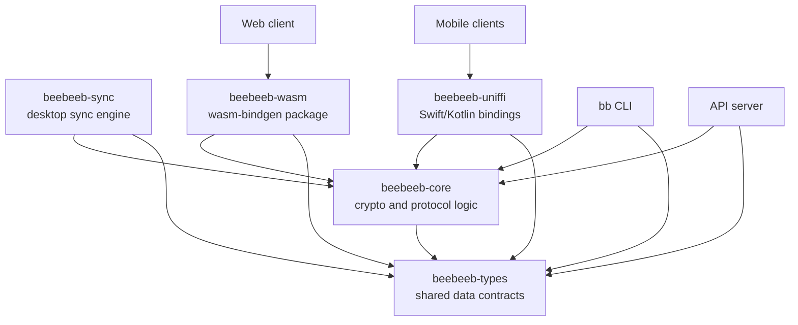

# Beebeeb Core

Beebeeb Core is the shared Rust cryptography and sync workspace for Beebeeb, an end-to-end encrypted, zero-knowledge cloud storage product made in Europe and operated by Initlabs B.V. (KvK 95157565), Wijchen, Netherlands.

This repository is the trust anchor for Beebeeb clients. The same Rust code is used by the web app through WebAssembly, by mobile apps through UniFFI bindings, by the CLI as a native Rust dependency, and by server-side code where shared types or protocol helpers are needed.

Target launch: September 1, 2026.

## Tech Stack

| Area | Technology |
| --- | --- |
| Language | Rust 2024 |
| Workspace crates | `beebeeb-core`, `beebeeb-types`, `beebeeb-sync`, `beebeeb-wasm`, `beebeeb-uniffi` |
| File encryption | AES-256-GCM |
| Key exchange | X25519 |
| Password KDF | Argon2id |
| Password-authenticated auth protocol | OPAQUE |
| Per-file derivation | HKDF-SHA256 |
| Recovery phrases | BIP39 |
| WASM bindings | `wasm-bindgen`, `wasm-pack` |
| Mobile bindings | UniFFI for Swift and Kotlin |

## Workspace Crates

| Crate | Purpose |
| --- | --- |
| `beebeeb-core` | Encryption, key derivation, recovery phrases, OPAQUE helpers, key exchange, erasure coding, sync protocol helpers. |
| `beebeeb-types` | Shared serializable types such as cipher suite identifiers, encrypted blob shapes, KDF parameters, chunk metadata, and storage constants. |
| `beebeeb-sync` | Desktop sync engine primitives: file watching, conflict handling, selective sync, and sync state. |
| `beebeeb-wasm` | WebAssembly bindings consumed by the web client as the `beebeeb-wasm` npm package generated under `beebeeb-wasm/pkg`. |
| `beebeeb-uniffi` | UniFFI library and binding generator for Swift and Kotlin clients. |

## Architecture



## Cryptographic Primitives

| Primitive | Use |
| --- | --- |
| AES-256-GCM | File, chunk, metadata, and local wrapping encryption. |
| X25519 | Key exchange for sharing and client-side key agreement flows. |
| Argon2id | Password-based key derivation. |
| HKDF-SHA256 | Per-file key derivation from the master key and file identifiers. |
| BIP39 | Recovery phrase generation and recovery. |
| OPAQUE | Password-authenticated key exchange where the server does not learn the password. |

Important invariants:

- `MasterKey` is 32 bytes, is not `Clone`, and is zeroized on drop.
- `FileKey` is 32 bytes and is derived per file.
- Encryption functions return `Result` instead of panicking in normal error paths.
- The recovery phrase is treated as the master recovery secret; a password wraps access to it.

## Prerequisites

- Rust stable with edition 2024 support.
- Cargo.
- `wasm-pack` for browser package builds.
- UniFFI toolchain support if regenerating Swift or Kotlin bindings.

## Quick Start

```sh
git clone https://github.com/beebeeb-io/core.git
cd core
cargo test --workspace
```

From the Beebeeb workspace checkout:

```sh
cd /Users/guuslangelaar/Development/Beebeeb/beebeeb.io/repos/core
cargo test --workspace
```

The expected workspace test suite currently covers 53 tests: 26 core tests and 27 sync tests.

## Build for Production

Build native Rust crates:

```sh
cd /Users/guuslangelaar/Development/Beebeeb/beebeeb.io/repos/core
cargo build --workspace --release
```

Build the WebAssembly package for the web client:

```sh
cd /Users/guuslangelaar/Development/Beebeeb/beebeeb.io/repos/core
wasm-pack build beebeeb-wasm --target web
```

The generated npm package is written under:

```text
beebeeb-wasm/pkg
```

Build UniFFI bindings:

```sh
cd /Users/guuslangelaar/Development/Beebeeb/beebeeb.io/repos/core
cargo build -p beebeeb-uniffi
```

Platform helper scripts are available for mobile binding artifacts:

```sh
./build-ios.sh
./build-android.sh
```

## Environment Variables

Core does not require runtime environment variables. It is a library workspace. Consumers such as the web, CLI, mobile, and server repos own their own runtime configuration.

Build tools may still require platform-specific environment setup. Examples include Rust target installation for mobile builds and local `wasm-pack` availability for WASM output.

## Tests and Checks

Run all tests:

```sh
cd /Users/guuslangelaar/Development/Beebeeb/beebeeb.io/repos/core
cargo test --workspace
```

Run compile checks:

```sh
cd /Users/guuslangelaar/Development/Beebeeb/beebeeb.io/repos/core
cargo check --workspace
```

Lint:

```sh
cd /Users/guuslangelaar/Development/Beebeeb/beebeeb.io/repos/core
cargo clippy --workspace -- -D warnings
```

Format check:

```sh
cd /Users/guuslangelaar/Development/Beebeeb/beebeeb.io/repos/core
cargo fmt -- --check
```

## Repository Layout

| Path | Purpose |
| --- | --- |
| `beebeeb-core/` | Core crypto and protocol implementation. |
| `beebeeb-types/` | Shared serializable type definitions. |
| `beebeeb-sync/` | Sync engine and selective-sync logic. |
| `beebeeb-wasm/` | WASM bindings and generated npm package output. |
| `beebeeb-uniffi/` | UniFFI library, generated bindings, and binding generator. |
| `build-ios.sh` | iOS static library and Swift binding build helper. |
| `build-android.sh` | Android shared library and Kotlin binding build helper. |

## Security Notes

- Do not add platform-specific reimplementations of crypto logic in client repos.
- Keep key material non-cloneable where possible and zeroized on drop.
- Treat generated bindings as part of the public crypto surface.
- Security reports should go to `security@beebeeb.io`.

## License

AGPL-3.0-or-later. See `LICENSE`.
